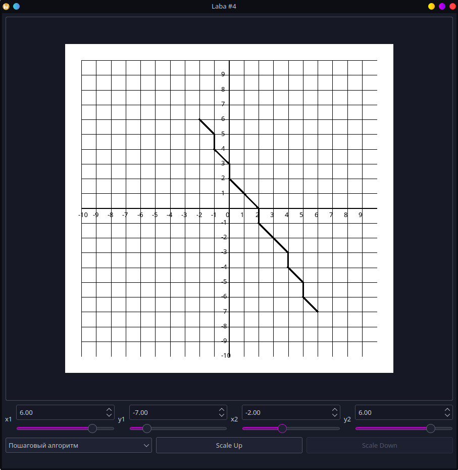

# Лабораторная работа №4 --- Базовые Алгоритмы Растеризации

- [Лабораторная работа №4 --- Базовые Алгоритмы Растеризации](#лабораторная-работа-4-----базовые-алгоритмы-растеризации)
  - [Постановка Задачи и Реализация](#постановка-задачи-и-реализация)
  - [Технические Параметры](#технические-параметры)
  - [Вывод](#вывод)

## Постановка Задачи и Реализация

Цель данной лабораторной заключалась в закреплении теоретического материала и в практическом освоении основных возможностей по использованию базовых алгоритмов растеризации отрезков и кривых.

Основными задачами которой являлись:

  1. Написать приложение/веб-приложение, которое иллюстрирует работу растровых алгоритмов.
  2. Реализовать базовые алгоритмы растеризации отрезков и кривых такие как:

    - пошаговый алгоритм
    - алгоритм ЦДА
    - алгоритм Брезенхема
    - алгоритм Брезенхема (окружность)

Реализованный функционал:

    - Отображение работы всех растровых алгоритмов на сетке.
    - Возможность выбора конерктного растрового алгоритма в Combobox.
    - Возможность изменения координат и радиуса.
    - Возможность изменения масштаба

## Технические Параметры

Платформа: кроссплатформенное приложение (протестировано под Manjaro Linux)

Использованные языки и среды программирования:

    - C++
    - QT Framework
    - Vim 

## Вывод

В ходе выполнения данной лабораторной:

  1. Было создано приложение, в котором визуализируется работа алгоритмов растеризации над заданными нами отрезками и кривыми.
  2. Был получен опыт работы с сеткой, осями координат и масштабом (который видоизменяется в зависимости от наших потребностей) в Qt.
  3. Был получен навык реализации базовых алгоритмов растеризации.
  4. Закрепили навык работы с GitHub.
